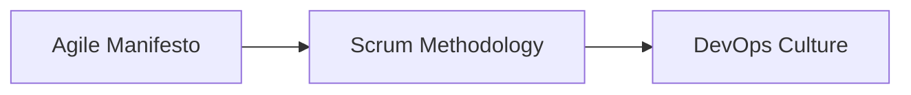

# DevOps & Linux Fundamentals Guide

*A Comprehensive Guide for Beginners*

---

## Table of Contents

1. [Understanding DevOps](#understanding-devops)
2. [Site Reliability Engineering (SRE)](#site-reliability-engineering-sre)
3. [Introduction to Linux](#introduction-to-linux)
4. [Linux Distributions](#linux-distributions)
5. [Getting Started with Terminal](#getting-started-with-terminal)

---

# Understanding DevOps

## What is DevOps?

DevOps represents a fundamental shift in how software applications and services are developed, deployed, and maintained throughout their lifecycle. Rather than following a traditional linear development process, DevOps embraces an iterative, collaborative approach.

### The Evolution: From Agile to DevOps



**Historical Context:**
- A group of CTOs collaborated to solve common development challenges
- The Agile Manifesto emerged from these collaborative sessions
- Agile's primary purpose: **rapid development**
- DevOps evolved under the Agile paradigm to address software development bottlenecks

### The Wall of Confusion

The traditional conflict between teams:

| Development Team | Operations Team |
|-----------------|-----------------|
| Wants to release new versions frequently | Wants to achieve maximum uptime |
| Focuses on feature delivery | Focuses on system stability |
| Embraces change | Prefers stability |

**The Solution (2007-2008):**
- Industry leaders recognized these problems could be solved through **automation** and **improved processes**
- Focus shifted to **collaboration** and **automation tools**
- Mindset changed to creating high-quality products rather than finding blame

## Core DevOps Principles

### Technical Practices

| Area | Practices |
|------|-----------|
| **Code Quality** | Design Patterns (Microservices, Domain-Driven Design), Test-Driven Development (TDD), Clean Code |
| **Build & Deployment** | Automated build tools, CI/CD pipelines |
| **Monitoring** | Comprehensive monitoring and deployment tools |
| **Operations** | Fault tolerance, scalability, infrastructure as code |

### Key Benefits

> 💡 **Important Insight**: Automation boosts code quality more than it improves speed

### Essential Skills for DevOps Engineers

DevOps engineering is an emerging field requiring both technical expertise and soft skills:

**Technical Skills:**
- Process automation
- Tool proficiency
- System architecture understanding
- Monitoring and observability

**Soft Skills:**
- Collaboration
- Communication
- Continuous learning mindset

> 📝 **Best Practice**: Learn the terminology of concepts and tools, as tools evolve but concepts remain consistent

---

# Site Reliability Engineering (SRE)

## Introduction to SRE

**Origin:** Introduced by Google around 2013

**Relationship:** SRE operates under the DevOps umbrella with specific responsibilities

| DevOps | SRE |
|--------|-----|
| Covers development to deployment | Focuses on uptime and availability |
| Broad operational scope | Specific reliability focus |
| Cultural transformation | Engineering discipline |

## SRE Key Concepts

### Service Level Indicators, Objectives, and Agreements

```
SLI (Indicators) → SLO (Objectives) → SLA (Agreements)
```

| Concept | Definition | Example |
|---------|------------|---------|
| **SLI** | Service Level Indicators - Metrics that measure service performance | Response time, error rate, availability |
| **SLO** | Service Level Objectives - Target values for SLIs | 99.9% uptime, <200ms response time |
| **SLA** | Service Level Agreements - Contracts with customers including penalties | 99.95% uptime with financial penalties for breaches |

### Zero Downtime Deployment

**Goal:** Achieve seamless transitions between:
- Different application versions
- Server migrations
- Infrastructure updates

**Methods:**
- Blue-green deployments
- Canary releases
- Rolling updates

---

# Introduction to Linux

## History and Background

**Creator:** Linus Torvalds
**Inspiration:** UNIX (created at Bell Labs)
**Origin:** University project that evolved into a global phenomenon

### The GNU/Linux Partnership

```
Linux Kernel + GNU Tools = Complete Operating System
```

**Key Characteristics:**
- **Open Source:** Source code freely available and modifiable
- **Community-Driven:** Developed by thousands of contributors worldwide
- **Highly Customizable:** Can be tailored for specific needs

## Why Linux Dominates Server Environments

| Advantage | Description |
|-----------|-------------|
| **Stability** | Exceptional uptime and reliability |
| **Security** | Robust permission system and active security community |
| **Performance** | Efficient resource utilization |
| **Cost-Effective** | No licensing fees |
| **Flexibility** | Customizable for any use case |

---

# Linux Distributions

## Popular Distributions in Practice

| Distribution | Use Case | Key Features |
|-------------|----------|--------------|
| **Ubuntu** | Desktop, Server, Development | User-friendly, extensive documentation, LTS versions |
| **Red Hat Enterprise Linux (RHEL)** | Enterprise servers | Commercial support, enterprise features, stability |
| **CentOS** | Servers, Development | Free RHEL clone, stable, enterprise-compatible |
| **Debian** | Servers, Desktop | Very stable, large software repository |
| **Amazon Linux** | AWS Cloud | Optimized for Amazon Web Services |

## Installation Options

### Direct Installation
```bash
# Install directly on hardware
# - Full performance
# - Complete control over hardware
# - Single OS environment
```

### Virtualization
```bash
# Using VMware, VirtualBox, or similar
# - Multiple OS on one machine
# - Easy snapshots and backups
# - Isolated environments for testing
```

### Cloud Instances
```bash
# AWS EC2, Azure VMs, Google Compute Engine
# - Pay-as-you-use
# - Global deployment
```

---

# Getting Started with Terminal

## Understanding the Terminal

**Server distributions** like Ubuntu Server typically have **no GUI** - only a command-line interface (Terminal).

### Terminal Characteristics

> ⚠️ **Important**: The terminal is **case-sensitive**. `File.txt` and `file.txt` are different!

### Basic Terminal Operations

```bash
# Get help for any command
help [command]
man [command]

# Clear the terminal screen
clear

# Display current date and time
date
```
*Happy learning, and welcome to the exciting world of DevOps!*